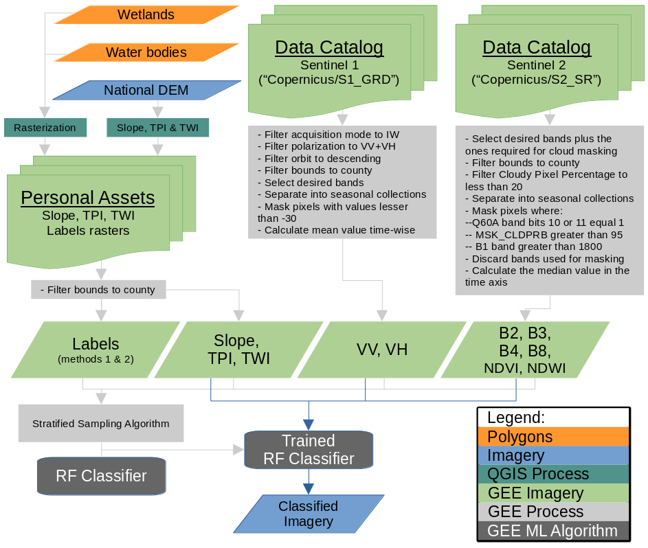
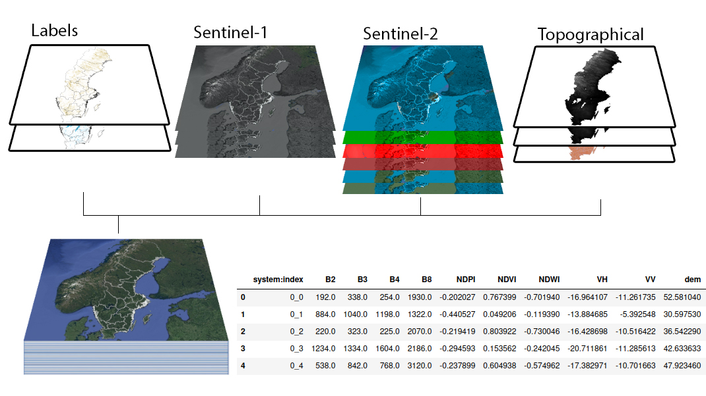

# Mapping Swedish Wetlands by classifying multi-source multi-temporal imagery with Random Forests in GEE

This repository contains the scripts used for mapping wetlands in Sweden (RFWI), classifying multi-temporal multi-source (Sentinel-1, Sentinel-2, Topographical) imagery with the Machine Learning Random Forests algorithm.

The main tree has the JavaScript code developed and run in the Google Earth Engine Code Editor / Playground, for generating the preliminary results displayed in the manuscript (). And the Jupyter Notebook with the scripts used for extracting and polishing those results.

The workflow followed by the script is coarsely illustrated with the following figure:

The script requires some personal assets upload by the user, more specifically:

1. Two rasterized (.tif) versions of polygons used for labeling (one for training and the other for validation, so the points of each set are not neighboring pixels), I differentiate three (3) classes for the study, wetlands, water and other LC types, but I don't believe there is any limitation to use more classes, even though I did not try. The raster was of byte type, and the integers 1, 2, and 3 referred to the forementioned classes, it was generated using GDAL, and the commands can be found in the Jupyter Notebook. This rasters are used to extract a user-input N amount of points in each class, with the GEE stratified sample algorithm. I found this to be the easiest way to employ this algorithm, sadly, I did not manage to perform the operation by uploading polygons. Please note that the rasterizations I used had a spatial resolution coinciding with of Sentinel-1 & Sentinel-2, and the variable 'separation' in the GEE_script can be tweaked so no training/validation point refers to a same pixel. Another consideration is that I digitized more than 5 squared kilometers (sqkm) of polygons for EACH class in the training set, and more than 15 sqkm for validation, to be able to fit 5,000 and 10,000 points (in each class), respectively.
2. Topographical data rasters, these are optional since this type of data can not be used as an input for the ML algorithm. And GEE has DEM's of good enough resolution in many regions, but not true in Sweden where the study was conducted. Nonetheless, I suggest using the Topographical Wetness Index (TWI) and the Topographical Position Index (TPI) since they were beneficial for my results, and which "might" be computed in GEE, but at the expense of valuable memory, that could be allocated to other processes, the same with the Slope, all computed from a DEM. NOTE: I found that using elevation data as an input variable for the Machine Learning algorithm, directly from the DEM, to be counter-productive.
3. A shapefile of the Swedish counties, with an attribute named LANSKOD, with values unique to each county, used to restrict the (rasters) training area, whose values must match with the key:value pair in GEE_script's counties_lanskod dictionary. This is optional, but this requires tweaking the GEE_Script so the areas are set by the user in other ways. Regarding this, some of the geometries contained in the script used are very complex, and GEE_Scripts's simplify_counties_shp() function is used to avoid computation timed out / user memory exceeded errors.

A more visual example of how the stratified sampling algorithm is used to prepare the imagery into a table for training the ML algorithm, after all the imagery is gathered and prepared:

After all of the personal assets and input data is set accordingly to your needs, there are some variables that can be set in every run:

1. TRAINING_REGION_STR: must be one of the counties_lanskod (variable) dictionary keys (e.g. 'Norrbotten'), or 'Sweden' in my case.
2. STRATIFIED_SAMPLE_GEOMETRIES: if geometries are required to be preserved and exported set to true, use with care, it allocates more memory, increasing the risk of reaching memory limits (set default to false).
3. N_POINTS_TRAINING: the amount of points to sample from EACH class in the first band of the training_labels target (I used 5000).
4. N_POINTS_VALIDATION: the amount of points to sample from EACH class in the first band of the training_labels target (I used 10000).
5. VERBOSE: true if printing information in the console for debugging is desired (true/false), this is a great way to see how results are working within the GEE environment, without exporting data outside the cloud. But bear in mind that if the stratified sample algorithm takes more than 5 minutes, the process that in my case took the most time, using VERBOSE == true won't succeed, but the exports will probably do.
6. YEAR_STR: a list of years (in string format) for gathering Sentinel-1 & Sentinel-2 imagery from the GEE repositories (I used ['2021']).
7. SEASONS: a list of strings that can contain any combination of the following strings: 'summer', 'spring', 'winter', 'fall'. I used ['summer'] only, due to very large areas in Sweden being covered by snow in all the other seasons.
8. BANDS: a list of lists of bands for each input, in this shape: [Sentinel_1_bands, Sentinel_2_bands, Sentinel_Indices, Topographical_Data]. I used [['VV','VH'], [], ['B2','B3','B4','B8'], ['NDVI','NDWI'], ['tpi','twi','slope']].

V1 folder contains less polished scripts, with valuable funtionalities that were dropped for the final manuscript (counting the amount of images, and exporting MODIS LC data). It is preserved as a deprecated version.
